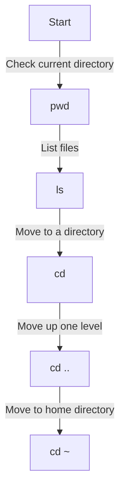
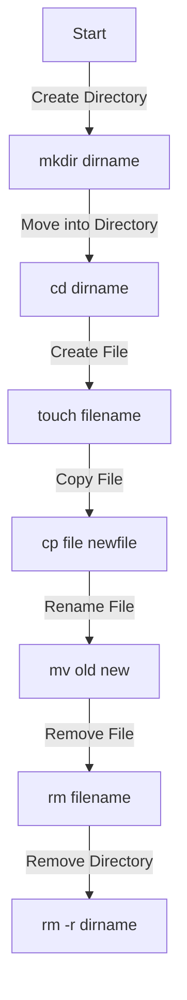
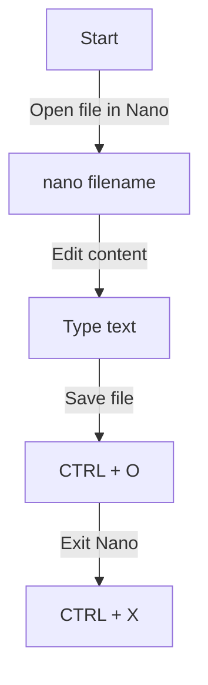
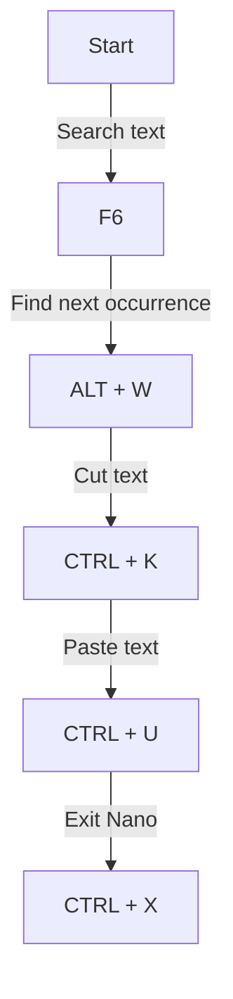

# Introduction to Basic Bash Commands and Nano Editor

## Part 1: Basic Bash Commands

### Objectives
- Learn to navigate the file system
- Understand how to create and manage files and directories
- Use flags to list files with additional details

### Note
We will be using the CloudShell terminal in AWS for this lab.

### 1. Navigating Directories
#### Commands:
```bash
pwd        # Print current working directory
ls         # List files in the current directory
ls -l      # List files with detailed information
ls -a      # List all files, including hidden files
cd <dir>   # Change to a specific directory
cd ..      # Move up one directory level
cd ~       # Move to the home directory
```

#### Directory Navigation Flow


#### Exercise:
1. Open a terminal.
2. Use the following command to check your current location:
```bash
pwd
```
3. List the files in the current directory:
```bash
ls
```
4. Navigate to the `/tmp` directory and confirm your location:
```bash
cd /tmp
pwd
```

---

### 2. Creating and Managing Files and Directories
#### Commands:
```bash
touch filename   # Create an empty file
mkdir dirname    # Create a directory
rm filename      # Remove a file
rmdir dirname    # Remove an empty directory
rm -r dirname    # Remove a directory and its contents
mv old new       # Rename or move a file or directory
cp file newfile  # Copy a file
```

#### File and Directory Management Flow


#### Exercise:
1. Create a directory named `bash_lab`:
```bash
mkdir bash_lab
```
2. Move into `bash_lab` and create an empty file `test.txt`:
```bash
cd bash_lab && touch test.txt
```
3. Copy `test.txt` to `test_copy.txt`:
```bash
cp test.txt test_copy.txt
```
4. Rename `test_copy.txt` to `backup.txt`:
```bash
mv test_copy.txt backup.txt
```
5. Remove `backup.txt`:
```bash
rm backup.txt
```

---

## Part 2: Introduction to Nano

### What is Nano?
Nano is a simple and user-friendly text editor for the command line. It is pre-installed on most Linux distributions and provides basic text editing functionalities, making it an excellent tool for beginners. Unlike more complex editors like Vim or Emacs, Nano is straightforward, featuring on-screen shortcuts for essential commands. It allows users to create, edit, search, and save files efficiently within a terminal environment.

### Why Use F6 Instead of CTRL + W in CloudShell?
Since AWS CloudShell runs in a web browser, certain keyboard shortcuts such as `CTRL + W` are intercepted by the browser instead of being passed to the terminal. In most web browsers, `CTRL + W` closes the current tab, which can lead to unintended disruptions while working in CloudShell. To avoid this, CloudShell maps `F6` as an alternative for searching within `nano`. Additionally, `ALT + W` can be used to find subsequent matches after an initial search.

### Objectives
- Learn how to create and edit files using `nano`
- Understand how to search and save contents

### 1. Opening and Editing Files
#### Commands:
```bash
nano filename  # Open or create a file
```

#### Nano Editing Flow


#### Exercise:
1. Open a terminal and navigate to `bash_lab`:
```bash
cd bash_lab
```
2. Run the following command to open Nano:
```bash
nano myfile.txt
```
3. Type some text inside the file.
4. Save the file by pressing `CTRL + O`, then `Enter`.
5. Exit Nano with `CTRL + X`.

---

### 2. Searching and Navigating in Nano
#### Commands:
```bash
F6        # Search for a word in CloudShell's Nano
ALT + W   # Find the next occurrence of the search term
CTRL + K  # Cut a line
CTRL + U  # Paste a line
CTRL + G  # Show help menu
```

#### Nano Navigation Flow


#### Exercise:
1. Open `myfile.txt` again in Nano:
```bash
nano myfile.txt
```
2. Use `F6` to search for a word.
3. Use `ALT + W` to find subsequent occurrences.
4. Try cutting (`CTRL + K`) and pasting (`CTRL + U`) text.
5. Exit and verify your changes with:
```bash
cat myfile.txt
```

---

### Conclusion
By completing this lab, you have gained fundamental skills in Bash and Nano. These are essential tools for navigating and managing files in a Linux environment. Keep practicing to improve efficiency!
