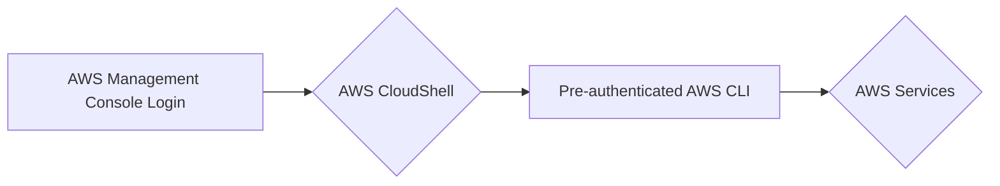
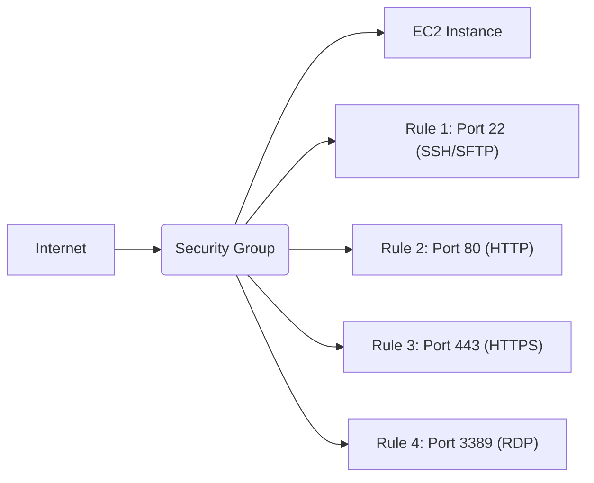
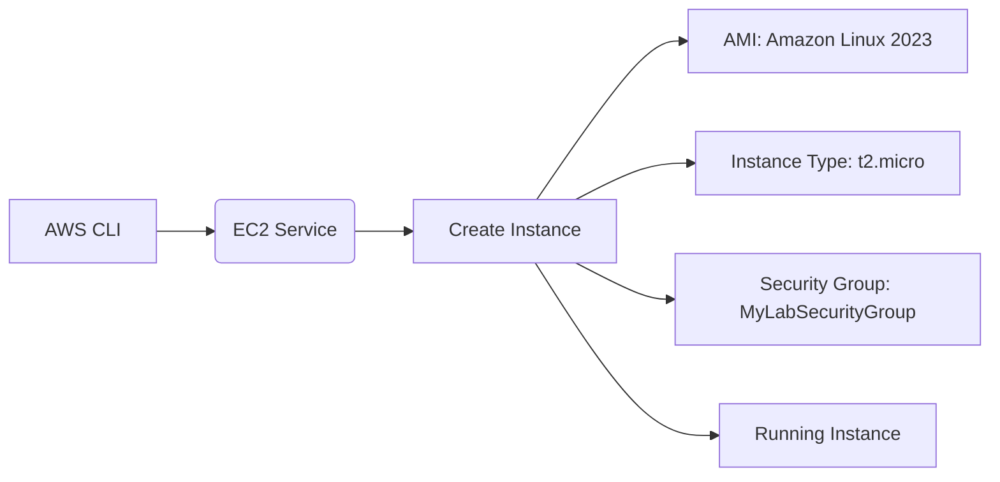
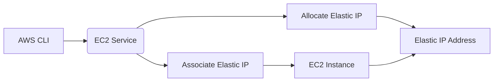

# AWS CLI Introduction Lab (Using CloudShell)

This lab introduces you to the Amazon Web Services (AWS) Command Line Interface (CLI), a powerful tool for managing your AWS resources. You'll learn how to create and configure an EC2 instance, assign an Elastic IP, and set up a security group.  This lab uses **AWS CloudShell**, so you don't need to install anything on your local machine.

---

## Agenda

1.  [Prerequisites and Accessing CloudShell](#1-prerequisites-and-accessing-cloudshell)
2.  [AWS CLI Introduction](#2-aws-cli-introduction)
3.  [Creating a Security Group](#3-creating-a-security-group)
4.  [Creating an EC2 Instance](#4-creating-an-ec2-instance)
5.  [Allocating and Associating an Elastic IP](#5-allocating-and-associating-an-elastic-ip)
6.  [Connecting to Your Instance](#6-connecting-to-your-instance)
7.  [Clean Up (Important!)](#7-clean-up-important)

---

## 1. Prerequisites and Accessing CloudShell

### 1.1 Accessing AWS CloudShell

1.  **Log in to the AWS Management Console:**
2.  **Open CloudShell:** In the top navigation bar, click the CloudShell icon (it looks like a small terminal window).  This will open a terminal window within your browser.  Alternatively, you can search for "CloudShell" in the search bar and select it.  
3. **Wait for CloudShell to initialize:** The first time you use CloudShell in a region, it might take a few minutes to set up. Subsequent launches will be faster. You should see a command prompt once it's ready.

---

## 2. AWS CLI Introduction

### Concept Introduction
AWS CloudShell comes with the AWS CLI pre-installed and pre-authenticated. This means you can start using the CLI immediately without needing to configure credentials.



### 2.1 Verify AWS CLI Version

Let's ensure everything is set up correctly.

```bash
aws --version
```

<details>
<summary>Expected Output (Example)</summary>

```
aws-cli/2.13.27 Python/3.11.6 Linux/4.14.330-250.540.amzn2int.x86_64 exe/x86_64.amzn.2 prompt/off
```
*(Your specific version numbers may vary.)*
</details>

### 2.2 Test the Configuration

Run a simple command to check if you can interact with AWS services.

```bash
aws sts get-caller-identity
```
<details>
<summary>Expected Output (Example)</summary>

```json
{
    "UserId": "AIDAJ45QEXAMPLEL7CQ5MA",
    "Account": "123456789012",
    "Arn": "arn:aws:iam::123456789012:user/your-username"
}
```
*(Your specific values will differ, reflecting your logged-in user.)*
</details>
This command confirms that your CloudShell session is correctly authenticated with your AWS account.

---
## 3. Creating a Security Group

### Concept Introduction

A security group acts as a virtual firewall for your EC2 instances, controlling inbound and outbound traffic. You define rules that specify which ports and protocols are allowed.



### 3.1 Create the Security Group

*   Use the `aws ec2 create-security-group` command:

    ```bash
    aws ec2 create-security-group --group-name "MyLabSecurityGroup" --description "Security group for AWS CLI lab" --vpc-id $(aws ec2 describe-vpcs --query 'Vpcs[0].VpcId' --output text)
    ```

      *   `--group-name`:  Specifies the name of the security group.
      *   `--description`:  Provides a description.
      *    `--vpc-id`: We are retrieving our default VPC and inserting it into the command.

    <details>
    <summary>Expected Output (Example)</summary>

    ```json
    {
        "GroupId": "sg-0abcdef1234567890"
    }
    ```

    *(Your GroupId will be different.)*

    </details>
*Take note of the "GroupID" value.*.

### 3.2 Add Inbound Rules

*   We'll add rules to allow SSH (port 22), RDP (port 3389), HTTP (port 80), HTTPS (port 443) and SFTP (port 22) traffic.

    ```bash
    # SSH and SFTP
    aws ec2 authorize-security-group-ingress --group-id <YOUR_SECURITY_GROUP_ID> --protocol tcp --port 22 --cidr 0.0.0.0/0

    # RDP
    aws ec2 authorize-security-group-ingress --group-id <YOUR_SECURITY_GROUP_ID> --protocol tcp --port 3389 --cidr 0.0.0.0/0

    # HTTP
    aws ec2 authorize-security-group-ingress --group-id <YOUR_SECURITY_GROUP_ID> --protocol tcp --port 80 --cidr 0.0.0.0/0

    # HTTPS
    aws ec2 authorize-security-group-ingress --group-id <YOUR_SECURITY_GROUP_ID> --protocol tcp --port 443 --cidr 0.0.0.0/0
    ```

      *   **Replace `<YOUR_SECURITY_GROUP_ID>` with the actual GroupId from the previous step.**
      *   `--group-id`:  Specifies the security group to modify.
      *   `--protocol`:  The protocol (tcp, udp, icmp, or all).
      *   `--port`: The port number or range.
      *   `--cidr`: The CIDR block to allow traffic from (0.0.0.0/0 allows traffic from anywhere - **for production, restrict this to your IP address**).
        *   **Note:** For a real-world, you should restrict `--cidr` to specific IP addresses or ranges for better security.

### 3.3 Verify Rules (DIY Task)

1.  **Use the `aws ec2 describe-security-groups` command to view the details of your security group.**  Use the `--group-ids` parameter and specify your security group ID.

2.  **Examine the output:** Verify that the `IpPermissions` section contains the rules you just added (ports 22, 80, 443, and 3389 with the specified CIDR blocks).

    <details>
    <summary>Example Command and Partial Output</summary>

    ```bash
    aws ec2 describe-security-groups --group-ids sg-0abcdef1234567890
    ```

    ```json
    {
        "SecurityGroups": [
            {
                "Description": "Security group for AWS CLI lab",
                "GroupName": "MyLabSecurityGroup",
                "IpPermissions": [
                    {
                        "IpProtocol": "tcp",
                        "FromPort": 22,
                        "ToPort": 22,
                        "IpRanges": [
                            {
                                "CidrIp": "0.0.0.0/0"
                            }
                        ]
                    },
                    {
                        "IpProtocol": "tcp",
                        "FromPort": 3389,
                        "ToPort": 3389,
                        "IpRanges": [
                            {
                                "CidrIp": "0.0.0.0/0"
                            }
                        ]
                    },
                    {
                        "IpProtocol": "tcp",
                        "FromPort": 80,
                        "ToPort": 80,
                        "IpRanges": [
                            {
                                "CidrIp": "0.0.0.0/0"
                            }
                        ]
                    },
                    {
                        "IpProtocol": "tcp",
                        "FromPort": 443,
                        "ToPort": 443,
                        "IpRanges": [
                            {
                                "CidrIp": "0.0.0.0/0"
                            }
                        ]
                    },
                  ...
                ],
                "OwnerId": "123456789012",
                "GroupId": "sg-0abcdef1234567890",
                "IpPermissionsEgress": [
                    {
                        "IpProtocol": "-1",
                        "IpRanges": [
                            {
                                "CidrIp": "0.0.0.0/0"
                            }
                        ],
                        "Ipv6Ranges": [],
                        "PrefixListIds": [],
                        "UserIdGroupPairs": []
                    }
                ],
                "VpcId": "vpc-0123456789abcdef0"
            }
        ]
    }
    ```

    </details>

-----

## 4\. Creating an EC2 Instance

### Concept Introduction

An EC2 instance is a virtual server in the AWS cloud. You can choose different instance types based on your needs (CPU, memory, storage, etc.).  We'll use the Amazon Linux 2023 AMI.



### 4.1 Find the AMI ID

*   We need to find the correct AMI ID for Amazon Linux 2023 in your chosen region.  We'll use the `aws ec2 describe-images` command with filters.

    ```bash
    aws ec2 describe-images --owners amazon --filters "Name=name,Values=al2023-ami-2023*-x86_64" "Name=state,Values=available" --query 'Images[*].[ImageId,Name,CreationDate]' --output text | sort -k3 -r | head -n 1
    ```

      *   `--owners amazon`:  Filters for images owned by Amazon.
      *   `--filters`: This is a powerful way to narrow down results.
        *   `"Name=name,Values=al2023-ami-2023*-x86_64"`:  Finds images with names starting with "al2023-ami-2023" and are x86\_64 architecture.  The `*` is a wildcard.
        *   `"Name=state,Values=available"`: Only includes images that are currently available.
      *   `--query`: Specifies which fields to output and formats them.
      *   `--output text`: Outputs the result as plain text.
      *   `sort -k3 -r`: Sort by the third column (CreationDate) in reverse order (newest first).
      *   `head -n 1`:  Takes only the first result (the newest AMI).

    <details>
    <summary>Expected Output (Example - Your AMI ID will differ)</summary>

    ```
    ami-0abcdef1234567890	al2023-ami-2023.2.20231218.0-kernel-6.1-x86_64	2023-12-19T02:15:05.000Z
    ```

    </details>

    **Copy the AMI ID (e.g., `ami-0abcdef1234567890`) from the output.** This is crucial for the next step.

### 4.2 Launch the Instance

*   Use the `aws ec2 run-instances` command:

    ```bash
    aws ec2 run-instances \
        --image-id <YOUR_AMI_ID> \
        --instance-type t2.micro \
        --security-group-ids <YOUR_SECURITY_GROUP_ID> \
        --key-name <YOUR_KEY_PAIR_NAME> \
        --count 1 \
        --query 'Instances[0].InstanceId' \
        --output text
    ```

      *   `--image-id`: The AMI ID you found in the previous step.
      *   `--instance-type`:  We're using `t2.micro`, which is eligible for the Free Tier (check eligibility for your region).
      *   `--security-group-ids`:  The ID of the security group you created earlier.
      *   `--key-name`:  **You need to create an EC2 key pair *before* running this command.**  Go to the EC2 console, navigate to "Key Pairs", and create a new key pair. Since you are using CloudShell the key will be stored in the CloudShell home directory. **Replace `<YOUR_KEY_PAIR_NAME>` with the name of your key pair.**
      *   `--count`:  We're launching a single instance.
      *   `--query` and `--output text`: These extract the instance ID from the JSON output.
      *   **If you don't have a key pair, create one now through the EC2 console or using the CLI command `aws ec2 create-key-pair --key-name MyKeyPair --query 'KeyMaterial' --output text > MyKeyPair.pem`. Remember to `chmod 400 MyKeyPair.pem` to set the correct permissions.**

    <details>
    <summary>Expected Output (Example - Instance ID will differ)</summary>

    ```
    i-0123456789abcdef0
    ```

    </details>

    **Copy the Instance ID (e.g., `i-0123456789abcdef0`).**  You'll need this later.
-----

## 5. Allocating and Associating an Elastic IP

### Concept Introduction

An Elastic IP address is a static, public IPv4 address that you can associate with your instance.  Unlike the public IP address assigned by default, an Elastic IP persists even if you stop and restart the instance.



### 5.1 Allocate an Elastic IP

```bash
aws ec2 allocate-address --domain vpc --query 'AllocationId' --output text
```

  *   `--domain vpc`:  Specifies that the Elastic IP should be for use in a VPC (which is the default for new AWS accounts).
  *   `--query 'AllocationId' --output text`: Extracts the allocation ID.
<details>
<summary>Expected Output (Example - Allocation ID will differ)</summary>

```
eipalloc-0fedcba9876543210
```
</details>

**Copy the Allocation ID (e.g., `eipalloc-0fedcba9876543210`).**

### 5.2 Associate the Elastic IP with Your Instance

```bash
aws ec2 associate-address --instance-id <YOUR_INSTANCE_ID> --allocation-id <YOUR_ALLOCATION_ID>
```

  *   `--instance-id`:  The ID of your EC2 instance (from Section 4).
  *   `--allocation-id`: The Allocation ID of your Elastic IP (from the previous step).
<details>
<summary>Expected Output (Example - Association ID will differ)</summary>

```json
{
    "AssociationId": "eipassoc-0abcdef12345678

````markdown
{
    "AssociationId": "eipassoc-0abcdef1234567890"
}
```
</details>

**Copy the Association ID (e.g., `eipassoc-0abcdef1234567890`).** You might need this for troubleshooting, but it's not strictly necessary for the rest of the lab.

### 5.3 Verify Association (DIY Task)

1.  **Use the `aws ec2 describe-instances` command to view the details of your instance.** Use the `--instance-ids` parameter with your instance ID.
2.  **Examine the output:** Find the `PublicIpAddress` field within the instance description.  Verify that it now shows the Elastic IP address you allocated, not a dynamically assigned public IP.
3. **Find and copy the 'PublicIpAddress' field value.** You'll need to connect to the server.

<details>
<summary>Example Command and Relevant Output Section</summary>

```bash
aws ec2 describe-instances --instance-ids i-0123456789abcdef0
```

```json
{
    "Reservations": [
        {
            "Instances": [
                {
                    ...
                    "PublicIpAddress": "3.14.159.265",  // Your Elastic IP
                    ...
                }
            ]
        }
    ]
}
```
</details>

---

## 6. Connecting to Your Instance

### Concept Introduction

Now that your instance is running and has an Elastic IP, you can connect to it using SSH (for Linux instances). Since we enabled RDP in the security group, you could also connect using a Remote Desktop client if this were a Windows instance.  Because we used an Amazon Linux 2023 AMI, we'll use SSH.

```mermaid
graph LR
    A[Your Computer] --> B[SSH Client]
    B --> C(Elastic IP)
    C --> D[EC2 Instance (Port 22)]
    B --> E[Private Key (.pem)]
```

### 6.1 Connect via SSH (from CloudShell)

Since you're already in CloudShell, you can connect directly without needing to transfer the key pair file.  CloudShell has the necessary tools built-in.

*   **Ensure your key pair's permissions are correct:**
    ```bash
    chmod 400 <YOUR_KEY_PAIR_NAME>.pem
    ```

*   **Connect using SSH:**

    ```bash
    ssh -i <YOUR_KEY_PAIR_NAME>.pem ec2-user@<YOUR_ELASTIC_IP>
    ```
    *   `-i <YOUR_KEY_PAIR_NAME>.pem`: Specifies the path to your private key file.
    *   `ec2-user`: The default username for Amazon Linux 2023 AMIs.
    *   `<YOUR_ELASTIC_IP>`:  The Elastic IP address you associated with your instance.

*   **First-time connection:** You'll likely see a warning about the authenticity of the host.  Type `yes` and press Enter to continue.  This adds the instance's fingerprint to your known hosts.

<details>
<summary>Example Connection and Output</summary>

```bash
ssh -i MyKeyPair.pem ec2-user@3.14.159.265
The authenticity of host '3.14.159.265 (3.14.159.265)' can't be established.
ED25519 key fingerprint is SHA256:xxxxxxxxxxxxxxxxxxxxxxxxxxxxxxxxxxxxxxx.
This key is not known by any other names
Are you sure you want to continue connecting (yes/no/[fingerprint])? yes
Warning: Permanently added '3.14.159.265' (ED25519) to the list of known hosts.

       __|  __|_  )
       _|  (     /   Amazon Linux 2023
      ___|\___|___|

[https://aws.amazon.com/linux/amazon-linux-2023/](https://aws.amazon.com/linux/amazon-linux-2023/)
[ec2-user@ip-172-31-42-184 ~]$
```
</details>

You are now connected to your EC2 instance! You can run commands on the instance as the `ec2-user`.

### 6.2 DIY Task

1.  **Run the `uptime` command on your EC2 instance.** This shows how long the instance has been running.
2.  **Run the `pwd` command.**  This shows your present working directory.
3.  **Run the `ls` command.** This lists the files and directories in your current location.
4. **Exit the SSH session:** Type `exit` and press Enter.  This will close the connection and return you to your CloudShell prompt.

<details>
<summary>Expected Output (Example)</summary>

```
[ec2-user@ip-172-31-42-184 ~]$ uptime
 22:17:53 up 1 min,  0 users,  load average: 0.00, 0.00, 0.00
[ec2-user@ip-172-31-42-184 ~]$ pwd
/home/ec2-user
[ec2-user@ip-172-31-42-184 ~]$ ls
[ec2-user@ip-172-31-42-184 ~]$ exit
logout
Connection to 3.14.159.265 closed.
```
</details>

---

## 7. Clean Up (Important!)

To avoid unnecessary charges, it's *crucial* to clean up the resources you created during this lab.

### 7.1 Terminate the EC2 Instance

```bash
aws ec2 terminate-instances --instance-ids <YOUR_INSTANCE_ID>
```

  *   `--instance-ids`: Your instance ID.

<details>
<summary>Expected Output (Example)</summary>

```json
{
    "TerminatingInstances": [
        {
            "CurrentState": {
                "Code": 32,
                "Name": "shutting-down"
            },
            "InstanceId": "i-0123456789abcdef0",
            "PreviousState": {
                "Code": 16,
                "Name": "running"
            }
        }
    ]
}
```
</details>

### 7.2 Release the Elastic IP

First, you need to disassociate it from the instance (if it's still associated). We can do this by using the Association ID. We can skip this part if the instance is already terminated as the Elastic IP is disassociated on termination. However, let's include a robust disassociation step using the `describe-addresses` command to *first* check if it's associated, and *then* disassociate only if needed.

```bash
# Find the AssociationId (if it exists) and Disassociate
ALLOCATION_ID=$(aws ec2 describe-addresses --filters "Name=public-ip,Values=<YOUR_ELASTIC_IP>" --query 'Addresses[0].AllocationId' --output text)

if [ ! -z "$ALLOCATION_ID" ]; then # Check if ALLOCATION_ID is not empty
  ASSOCIATION_ID=$(aws ec2 describe-addresses --filters "Name=public-ip,Values=<YOUR_ELASTIC_IP>" --query 'Addresses[0].AssociationId' --output text)
    if [ ! -z "$ASSOCIATION_ID" ]; then # Check if association exists.
      aws ec2 disassociate-address --association-id $ASSOCIATION_ID
    fi
  aws ec2 release-address --allocation-id $ALLOCATION_ID
else
  echo "Elastic IP <YOUR_ELASTIC_IP> not found or not allocated."
fi

```

* Replace `<YOUR_ELASTIC_IP>` with the actual Elastic IP.
* This script first gets the AllocationId.
* It then *checks* if the `ALLOCATION_ID` variable is not empty. This handles the case where the Elastic IP might not exist or was already released.
* *If* the Allocation ID exists, it attempts to get an Association ID.
* *If* the Association ID exists, it disassociates the Elastic IP.
* Finally, it releases the Elastic IP using the Allocation ID.
* If no Allocation ID is found, it prints a message. This makes the cleanup process more robust.

<details>
<summary>Expected Output (Disassociate - if it was associated)</summary>

```
# (No output if successful)
```
</details>

<details>
<summary>Expected Output (Release)</summary>

```
# (No output if successful)
```
</details>
<details>
<summary>Expected Output (Elastic IP not found)</summary>
Elastic IP 3.14.159.265 not found or not allocated.
</details>

### 7.3 Delete the Security Group

```bash
aws ec2 delete-security-group --group-id <YOUR_SECURITY_GROUP_ID>
```

  *   `--group-id`: Your security group ID.

<details>
<summary>Expected Output</summary>

```
# (No output if successful)
```
</details>

### 7.4 Delete your Key Pair (Optional)
You can also delete the key pair, if desired using the command below.
```bash
aws ec2 delete-key-pair --key-name <YOUR_KEY_PAIR_NAME>
```

### 7.5 Confirm Deletion (DIY Task)

1.  **Use the `aws ec2 describe-instances` command *without* any filters.**  The output should show no running or terminated instances (or only instances you created *outside* of this lab).
2.  **Use the `aws ec2 describe-addresses` command.** This should return an empty list, indicating that you have no allocated Elastic IPs.
3.  **Use the `aws ec2 describe-security-groups` command.** This should show only the default security group(s) for your VPC, and *not* the `MyLabSecurityGroup`.

These checks confirm that you've successfully cleaned up all the resources created during the lab.

---

End of Lab
