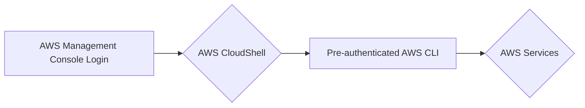
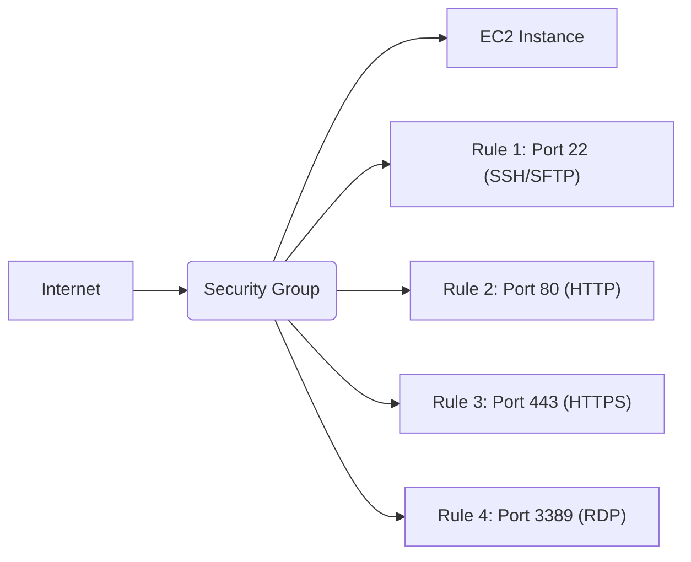
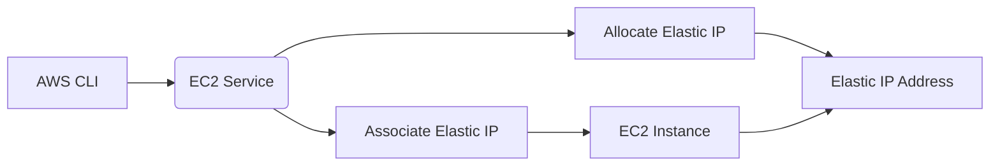
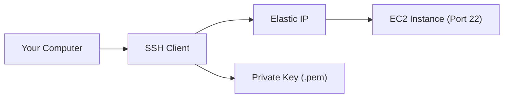

# AWS CLI Introduction Lab (Using CloudShell)

This lab introduces you to the Amazon Web Services (AWS) Command Line Interface (CLI), a powerful tool for managing your AWS resources. You'll learn how to create and configure an EC2 instance, assign Security Groups, and manage Key Pairs. By the end of this lab, you will have a running EC2 instance that you can connect to via SSH.

---

## Agenda

1.  [Prerequisites and Accessing CloudShell](#1-prerequisites-and-accessing-cloudshell)
2.  [AWS CLI Introduction](#2-aws-cli-introduction)
3.  [Creating a Security Group](#3-creating-a-security-group)
4.  [Key Pair Creation](#4-key-pair-creation)
5.  [Creating an EC2 Instance](#5-creating-an-ec2-instance)
6.  [Allocating and Associating an Elastic IP](#6-allocating-and-associating-an-elastic-ip)
7.  [Connecting to Your Instance](#7-connecting-to-your-instance)
8.  [Clean Up (Important!)](#8-clean-up-important)
9.  [Automated Script Creation via AI](#9-automated-script-creation-via-ai)

---

## 1. Prerequisites and Accessing CloudShell

### 1.1 Accessing AWS CloudShell

1. **Log in to the AWS Management Console:**
2. **Open CloudShell:** In the top navigation bar, click the CloudShell icon (it looks like a small terminal window). This will open a terminal window within your browser. Alternatively, you can find CloudShell under the "Services" menu by searching for "CloudShell".
3. **Wait for CloudShell to initialize:** The first time you use CloudShell in a region, it might take a few minutes to set up. Subsequent launches will be faster. You should see a command prompt once CloudShell is ready.

---

## 2. AWS CLI Introduction

### Concept Introduction
AWS CloudShell comes with the AWS CLI pre-installed and pre-authenticated. This means you can start using the CLI immediately without needing to configure credentials.



### 2.1 Verify AWS CLI Version
Let's ensure everything is set up correctly.

```bash
aws --version
```

<details>
<summary>Expected Output (Example)</summary>

```
aws-cli/2.13.27 Python/3.11.6 Linux/4.14.330-250.540.amzn2int.x86_64 exe/x86_64.amzn.2 prompt/off
```

*(Your specific version numbers may vary.)*
</details>

### 2.2 Test the Configuration
Run a simple command to check if you can interact with AWS services.

```bash
aws sts get-caller-identity
```

<details>
<summary>Expected Output (Example)</summary>

```json
{
    "UserId": "AIDAJ45QEXAMPLEL7CQ5MA",
    "Account": "123456789012",
    "Arn": "arn:aws:iam::123456789012:user/your-username"
}
```

*(Your specific values will differ, reflecting your logged-in user.)*
</details>

This command confirms that your CloudShell session is correctly authenticated with your AWS account.

---

## 3. Creating a Security Group

### Concept Introduction
A security group acts as a virtual firewall for your EC2 instances, controlling inbound and outbound traffic. You define rules that specify which ports and protocols are allowed.



### 3.1 Create the Security Group
Create the security group and tag it with the name "LabSecurityGroup". 

```bash
SECURITY_GROUP_ID=$(aws ec2 create-security-group --group-name LabSecurityGroup --description "Security group for AWS CLI lab" --query 'GroupId' --output text)
```

Then, tag the security group:

```bash
aws ec2 create-tags --resources $SECURITY_GROUP_ID --tags Key=Name,Value=LabSecurityGroup
```

### 3.2 Add Inbound Rules
Add rules to allow SSH (port 22), RDP (port 3389), HTTP (port 80), and HTTPS (port 443) traffic.

```bash
# SSH and SFTP
aws ec2 authorize-security-group-ingress --group-id $SECURITY_GROUP_ID --protocol tcp --port 22 --cidr 0.0.0.0/0

# HTTP
aws ec2 authorize-security-group-ingress --group-id $SECURITY_GROUP_ID --protocol tcp --port 80 --cidr 0.0.0.0/0

# HTTPS
aws ec2 authorize-security-group-ingress --group-id $SECURITY_GROUP_ID --protocol tcp --port 443 --cidr 0.0.0.0/0
```

### 3.3 Verify Rules (DIY Task)
1. **Use the `aws ec2 describe-security-groups` command** to view your security group details using the `$SECURITY_GROUP_ID`.
2. **Examine the output:** Verify that the `IpPermissions` section contains the rules you added.

<details>
<summary>Example Command and Partial Output</summary>

```bash
aws ec2 describe-security-groups --group-ids $SECURITY_GROUP_ID
```

```json
{
    "SecurityGroups": [
        {
            "Description": "Security group for AWS CLI lab",
            "GroupName": "LabSecurityGroup",
            "IpPermissions": [
                {
                    "IpProtocol": "tcp",
                    "FromPort": 22,
                    "ToPort": 22,
                    "IpRanges": [
                        {
                            "CidrIp": "0.0.0.0/0"
                        }
                    ]
                },
                {
                    "IpProtocol": "tcp",
                    "FromPort": 3389,
                    "ToPort": 3389,
                    "IpRanges": [
                        {
                            "CidrIp": "0.0.0.0/0"
                        }
                    ]
                },
                {
                    "IpProtocol": "tcp",
                    "FromPort": 80,
                    "ToPort": 80,
                    "IpRanges": [
                        {
                            "CidrIp": "0.0.0.0/0"
                        }
                    ]
                },
                {
                    "IpProtocol": "tcp",
                    "FromPort": 443,
                    "ToPort": 443,
                    "IpRanges": [
                        {
                            "CidrIp": "0.0.0.0/0"
                        }
                    ]
                }
            ],
            "GroupId": "$SECURITY_GROUP_ID",
            "IpPermissionsEgress": [
                {
                    "IpProtocol": "-1",
                    "IpRanges": [
                        {
                            "CidrIp": "0.0.0.0/0"
                        }
                    ]
                }
            ],
            "VpcId": "vpc-0123456789abcdef0"
        }
    ]
}
```

</details>

---

## 4. Key Pair Creation

Before launching your EC2 instance, you must create an EC2 key pair. The key pair allows you to securely SSH into your instance.

Create the key pair and tag it (using the name "LabKeyPair"):

```bash
aws ec2 create-key-pair --key-name LabKeyPair --tag-specifications "ResourceType=key-pair,Tags=[{Key=Name,Value=LabKeyPair}]" --query 'KeyMaterial' --output text > LabKeyPair.pem
```

Then, protect your private key file by setting the correct permissions:

```bash
chmod 400 LabKeyPair.pem
```

You will use `LabKeyPair` as the value for the `--key-name` parameter when launching your instance.

---

## 5. Creating an EC2 Instance

### Concept Introduction
An EC2 instance is a virtual server in the AWS cloud. You can choose different instance types based on your needs (CPU, memory, storage, etc.). We'll use the Amazon Linux 2023 AMI.


### 5.1 Find the AMI ID
Find the correct AMI ID for Amazon Linux 2023 in your chosen region using this command:

```bash
AMI_ID=$(aws ec2 describe-images --owners amazon --filters "Name=name,Values=al2023-ami-2023*-x86_64" "Name=state,Values=available" --query 'Images[*].[ImageId]' --output text | sort -k1 -r | head -n 1)
```

### 5.2 Launch the Instance
Launch the instance while tagging it with the name "LabInstance":

```bash
INSTANCE_ID=$(aws ec2 run-instances \
    --image-id $AMI_ID \
    --instance-type t2.micro \
    --security-group-ids $SECURITY_GROUP_ID \
    --key-name LabKeyPair \
    --count 1 \
    --tag-specifications "ResourceType=instance,Tags=[{Key=Name,Value=LabInstance}]" \
    --query 'Instances[0].InstanceId' \
    --output text)
```

Copy the Instance ID (e.g., `i-0123456789abcdef0`) for later steps.

---

## 6. Allocating and Associating an Elastic IP

### Concept Introduction
An Elastic IP address is a static, public IPv4 address that you can assign to your instance. It persists even if your instance stops and restarts.



### 6.1 Allocate an Elastic IP
Allocate an Elastic IP address and then tag it as "LabElasticIP":

```bash
ALLOCATION_ID=$(aws ec2 allocate-address --domain vpc --query 'AllocationId' --output text)
```

Then tag the Elastic IP:

```bash
aws ec2 create-tags --resources $ALLOCATION_ID --tags Key=Name,Value=LabElasticIP
```

<details>
<summary>Expected Output (Example - Allocation ID will differ)</summary>

```
eipalloc-0fedcba9876543210
```

</details>

Copy the Allocation ID (e.g., `eipalloc-0fedcba9876543210`).

### 6.2 Associate the Elastic IP with Your Instance
Associate the Elastic IP with your instance:

```bash
aws ec2 associate-address --instance-id $INSTANCE_ID --allocation-id $ALLOCATION_ID
```

<details>
<summary>Expected Output (Example - Association ID will differ)</summary>

```json
{
    "AssociationId": "eipassoc-0abcdef1234567890"
}
```

</details>

Copy the Association ID (e.g., `eipassoc-0abcdef1234567890`) for troubleshooting if needed.

### 6.3 Verify Association (DIY Task)
1. **Use `aws ec2 describe-instances`** with the `$INSTANCE_ID` to verify the instance details.
2. **Check the `PublicIpAddress` field:** It should now display the Elastic IP.

<details>
<summary>Example Command and Output Section</summary>

```bash
aws ec2 describe-instances --instance-ids $INSTANCE_ID
```

```json
{
    "Reservations": [
        {
            "Instances": [
                {
                    ...
                    "PublicIpAddress": "3.14.159.265",  // Your Elastic IP
                    ...
                }
            ]
        }
    ]
}
```

</details>

---

## 7. Connecting to Your Instance

### Concept Introduction
Now that your instance is running and has an Elastic IP, you can connect to it via SSH (for Linux instances). (If you're using Windows, you might connect using Remote Desktop.)



### 7.1 Connect via SSH (from CloudShell)
Since you're already in CloudShell, connect directly without needing to transfer the key pair file. Ensure the key pair file has the correct permissions:

```bash
chmod 400 LabKeyPair.pem
```

Connect using SSH:

```bash
ssh -o StrictHostKeyChecking=no -i LabKeyPair.pem ec2-user@$ELASTIC_IP
```

<details>
<summary>Example Connection and Output</summary>

```bash
ssh -o StrictHostKeyChecking=no -i LabKeyPair.pem ec2-user@3.14.159.265
The authenticity of host '3.14.159.265 (3.14.159.265)' can't be established.
ED25519 key fingerprint is SHA256:xxxxxxxxxxxxxxxxxxxxxxxxxxxxxxxxxxxxxxx.
This key is not known by any other names.
Are you sure you want to continue connecting (yes/no/[fingerprint])? yes
Warning: Permanently added '3.14.159.265' (ED25519) to the list of known hosts.

       __|  __|_  )
       _|  (     /   Amazon Linux 2023
      ___|\___|___|

[https://aws.amazon.com/linux/amazon-linux-2023/](https://aws.amazon.com/linux/amazon-linux-2023/)
[ec2-user@ip-172-31-42-184 ~]$
```

</details>

You are now connected to your EC2 instance and can run commands on it.

### 7.2 DIY Tasks
1. **Run the `uptime` command** on your EC2 instance to see how long it's been running.
2. **Run the `pwd` command** to view your current directory.
3. **Run the `ls` command** to list files and directories.
4. **Exit the SSH session:** Type `exit` and press Enter.

<details>
<summary>Expected Output (Example)</summary>

```
[ec2-user@ip-172-31-42-184 ~]$ uptime
 22:17:53 up 1 min,  0 users,  load average: 0.00, 0.00, 0.00
[ec2-user@ip-172-31-42-184 ~]$ pwd
/home/ec2-user
[ec2-user@ip-172-31-42-184 ~]$ ls
[ec2-user@ip-172-31-42-184 ~]$ exit
logout
Connection to 3.14.159.265 closed.
```

</details>

---

## 8. Clean Up (Important!)

To avoid unexpected costs, clean up all the resources created during this lab.

### 8.1 Terminate the EC2 Instance

```bash
aws ec2 terminate-instances --instance-ids $INSTANCE_ID
```

<details>
<summary>Expected Output (Example)</summary>

```json
{
    "TerminatingInstances": [
        {
            "CurrentState": {
                "Code": 32,
                "Name": "shutting-down"
            },
            "InstanceId": "$INSTANCE_ID",
            "PreviousState": {
                "Code": 16,
                "Name": "running"
            }
        }
    ]
}
```

</details>

### 8.2 Release the Elastic IP

First, disassociate it from the instance (if still associated):

```bash
# Find the AllocationId using the tag and disassociate if needed
ALLOCATION_ID=$(aws ec2 describe-addresses --filters "Name=tag:Name,Values=LabElasticIP" --query 'Addresses[0].AllocationId' --output text)

if [ ! -z "$ALLOCATION_ID" ]; then
  ASSOCIATION_ID=$(aws ec2 describe-addresses --filters "Name=allocation-id,Values=$ALLOCATION_ID" --query 'Addresses[0].AssociationId' --output text)
    if [ ! -z "$ASSOCIATION_ID" ]; then
      aws ec2 disassociate-address --association-id $ASSOCIATION_ID
    fi
  aws ec2 release-address --allocation-id $ALLOCATION_ID
else
  echo "Elastic IP with tag LabElasticIP not found or not allocated."
fi
```

### 8.3 Delete the Security Group

```bash
aws ec2 delete-security-group --group-id $SECURITY_GROUP_ID
```

<details>
<summary>Expected Output</summary>

```
# (No output if successful)
```

</details>

### 8.4 Delete the Key Pair (Optional)
Delete the key stored on AWS:

```bash
aws ec2 delete-key-pair --key-name LabKeyPair
```
Delete the key stored on your cloudshell instance:

```bash
rm  LabKeyPair.pem
```

### 8.5 Confirm Deletion (DIY Task)
1. **Run `aws ec2 describe-instances`** without filters to check that no unexpected instances remain.
2. **Run `aws ec2 describe-addresses`** to verify there are no allocated Elastic IPs.
3. **Run `aws ec2 describe-security-groups`** to confirm only the default groups remain.

These steps ensure that you have cleaned all the resources created during this lab.

## 9. Automated Script Creation via AI

Use an AI chat service to create two automated AWS scripts from the content in this lab. One script will create the new instnace and the other will delete it and its resources. 

### 9.1 Write the prompt

Create a prompt to generate the two scripts. 
```txt
Using the content of lab, create two AWS scripts. One script will create the new EC2 instance and the other will delete the instance and associated resources
```

### 9.2 Save the scripts to your CloudShell instance

Use nano to help create two new bash file to hold your new scripts. Run the following permissions command to make the files executable

```bash
chmod 777 aws_script_make.sh
```

---
