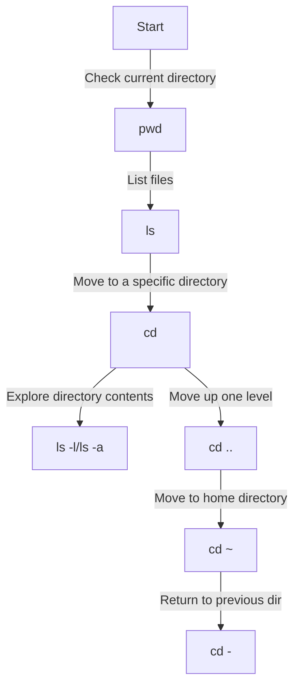
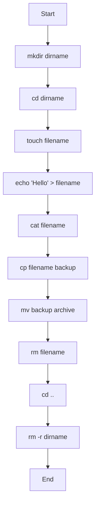
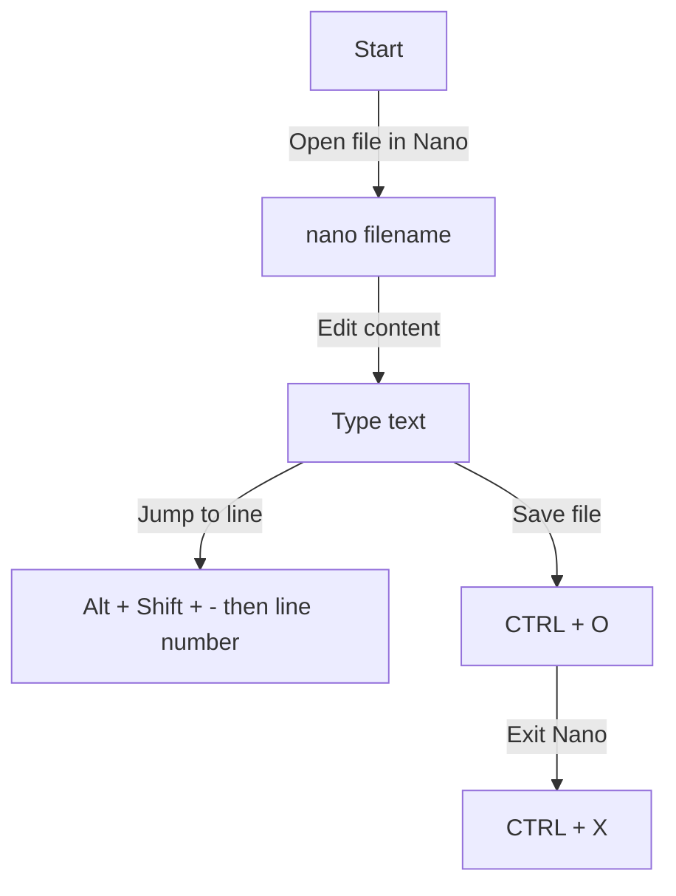
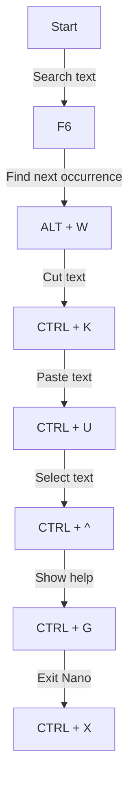

# Introduction to Basic Bash Commands and Nano Editor

## Part 1: Basic Bash Commands

### Objectives
- Learn to navigate the file system
- Understand how to create and manage files and directories
- Use flags to list files with additional details
- Explore useful file management commands
- Get comfortable with command chaining and history

### Note
We will be using the CloudShell terminal in AWS for this lab, but the commands work in any standard Unix-like environment.

---

### 1. Navigating Directories

#### What is a Directory?
A directory (or folder) organizes and stores files and other directories. Navigating directories is the foundation of command-line work.

#### Commands:
```bash
pwd              # Print current working directory
ls               # List files in the current directory
ls -l            # List files with detailed information
ls -a            # List all files, including hidden files
ls -lh           # List files with human-readable sizes
ls -lt           # List files sorted by modification time
ls /path/to/dir  # List files in a specific directory
cd <dir>         # Change to a specific directory
cd ..            # Move up one directory level
cd ~             # Move to the home directory
cd -             # Switch to the previous directory
```

#### Directory Navigation Flow


#### Extra Tips:
- Use the `TAB` key for auto-completion of file and directory names.
- Use `ls -lh` to see file sizes in KB/MB.
- Press the **Up** arrow key to cycle through past commands.

#### Exercise:
1. Open a terminal.
2. Use the following command to check your current location:
    ```bash
    pwd
    ```
3. List the files in the current directory:
    ```bash
    ls
    ```
4. Navigate to the `/tmp` directory and confirm your location:
    ```bash
    cd /tmp
    pwd
    ```
5. Go to your home directory, then return to the previous directory:
    ```bash
    cd ~
    cd -
    ```
6. Try using `ls -lh` and `ls -lt` to see file details and sort them by time.
7. Check for hidden files:
    ```bash
    ls -a
    ```

---

### 2. Creating and Managing Files and Directories

#### Commands:
```bash
touch filename            # Create an empty file
mkdir dirname             # Create a directory
mkdir -p parent/child     # Create nested directories in one command
rm filename               # Remove a file
rm -i filename            # Remove a file with confirmation
rmdir dirname             # Remove an empty directory
rm -r dirname             # Remove a directory and its contents
mv old new                # Rename or move a file or directory
cp file newfile           # Copy a file
cp -r dir1 dir2           # Copy an entire directory
cat filename              # Display the contents of a file
head filename             # Show the first 10 lines of a file
tail filename             # Show the last 10 lines of a file
```

#### File and Directory Management Flow


#### Extra Tips:
- Use `cat`, `head`, and `tail` to preview file contents without opening them in an editor.
- Use `mkdir -p` for creating multi-level directory structures.
- `rm -i` will prompt before deleting, reducing mistakes.

#### Exercise:
1. Create a directory tree with a subdirectory (e.g., `labs/week1`):
    ```bash
    mkdir -p labs/week1
    ```
2. Move into `labs/week1` and create two files, `test.txt` and `example.txt`:
    ```bash
    cd labs/week1
    touch test.txt example.txt
    ```
3. Write your name into `test.txt` using `echo`:
    ```bash
    echo "YourName" > test.txt
    ```
4. View the contents of `test.txt`. Then append another line:
    ```bash
    cat test.txt
    echo "Another Line" >> test.txt
    head test.txt
    ```
5. Copy `test.txt` to `copy.txt` and confirm both exist:
    ```bash
    cp test.txt copy.txt
    ls
    ```
6. Rename `example.txt` to `sample.txt`:
    ```bash
    mv example.txt sample.txt
    ```
7. Delete `sample.txt` and the copied file:
    ```bash
    rm sample.txt copy.txt
    ```
8. Navigate back to the parent directory and remove the `week1` directory:
    ```bash
    cd ..
    rm -r week1
    ```
9. Try using `history` to see a list of commands you’ve run so far.

---

## Part 2: Introduction to Nano

### What is Nano?
Nano is a simple and user-friendly text editor for the command line. It’s great for editing configuration files or creating documents quickly.

### Why Use F6 Instead of CTRL + W in CloudShell?
Since AWS CloudShell runs in a web browser, certain keyboard shortcuts such as `CTRL + W` are intercepted by the browser instead of being passed to the terminal. In most web browsers, `CTRL + W` closes a tab. Nano provides alternative shortcuts such as `F6` to help you search inside files safely.

### Objectives
- Learn how to create and edit files using `nano`
- Understand how to search, save, and navigate contents
- Master cutting, copying, and pasting lines
- Learn about Nano's help system

---

### 1. Opening and Editing Files

#### Commands:
```bash
nano filename         # Open or create a file
nano +N filename      # Open file and move to line N
```

#### Nano Editing Flow


#### Extra Tips:
- Use `CTRL + G` in Nano at any time to open the help menu.
- The bottom two lines show available commands, usually with `^` (CTRL) or `M` (ALT).
- Use `CTRL + _` followed by a number to jump to a line (helpful in long files).

#### Exercise:
1. Open a terminal and navigate to `bash_lab` or the directory you created earlier:
    ```bash
    cd ~/bash_lab
    ```
2. Run the following command to open Nano:
    ```bash
    nano myfile.txt
    ```
3. Type a short story or several lines of text inside the file.
4. Try moving your cursor with arrow keys, and experiment with `Page Up`/`Page Down`.
5. Jump to the third line using:
    - `CTRL + _`
    - Type `3` and press `Enter`.
6. Save the file by pressing `CTRL + O`, then `Enter`.
7. Exit Nano with `CTRL + X`.
8. Re-open the file and check your changes with:
    ```bash
    cat myfile.txt
    ```

---

### 2. Searching and Navigating in Nano

#### Commands:
```bash
F6            # Search for a word in CloudShell's Nano
ALT + W       # Find the next occurrence of the search term
CTRL + K      # Cut a line
CTRL + U      # Paste a line
CTRL + ^      # Begin selecting text (mark set)
CTRL + G      # Show help menu
```

#### Nano Navigation Flow


#### Extra Tips:
- `CTRL + K` cuts the whole line the cursor is on and stores it in a buffer.
- `CTRL + U` pastes the line(s) from the buffer at the current location.
- You can select multiple lines with `CTRL + ^` (set mark), then move the cursor and cut/copy.
- If you forget a command, use `CTRL + G` for help.

#### Exercise:
1. Open `myfile.txt` in Nano again:
    ```bash
    nano myfile.txt
    ```
2. Use `F6` to search for a word you typed earlier.
3. Use `ALT + W` to find the next occurrence of the search term.
4. Try cutting (`CTRL + K`) and pasting (`CTRL + U`) lines of your text.
5. Use `CTRL + ^` to select text from the current cursor location, then cut or copy it.
6. Exit and verify your changes with:
    ```bash
    cat myfile.txt
    ```

---

### 3. Bonus: More Bash and Nano Practice

#### Chaining Commands
Combine multiple commands on a single line using `;` or `&&`:
```bash
cd ~ && ls -a
mkdir testdir; cd testdir; touch file1.txt file2.txt
```

#### Redirecting Output
Send output to files:
```bash
echo "Bash is awesome!" > bash_notes.txt
cat bash_notes.txt >> myfile.txt
```

#### Useful Nano Options
- `nano -c filename` shows line numbers.
- `nano -m filename` enables mouse support (if available).

#### Practice Exercise:
1. Create three files and write something different into each (using `echo` and redirection).
2. Open each in Nano and make edits.
3. Try copying text between files (cut from one, paste in another).
4. Use `cat`, `head`, and `tail` to review file contents outside of Nano.

---

### Conclusion

By completing this lab, you have gained fundamental skills in Bash navigation, file management, and Nano text editing. These are essential tools for navigating and managing files in a Linux environment. Keep practicing with new directories, files, and larger exercises (such as scripts or editing configuration files) to improve confidence and efficiency!
