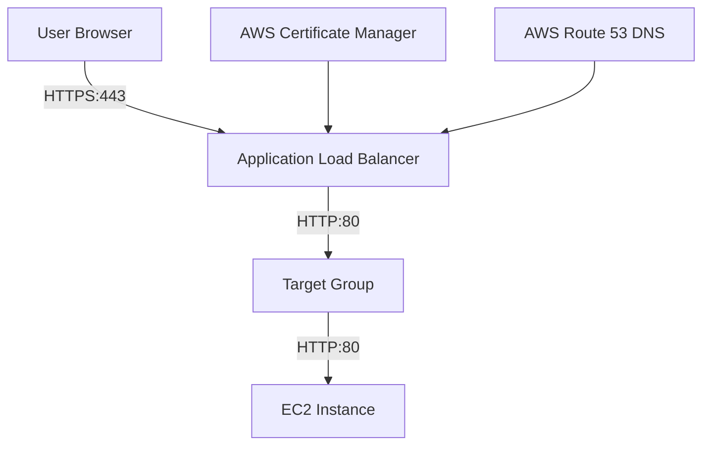
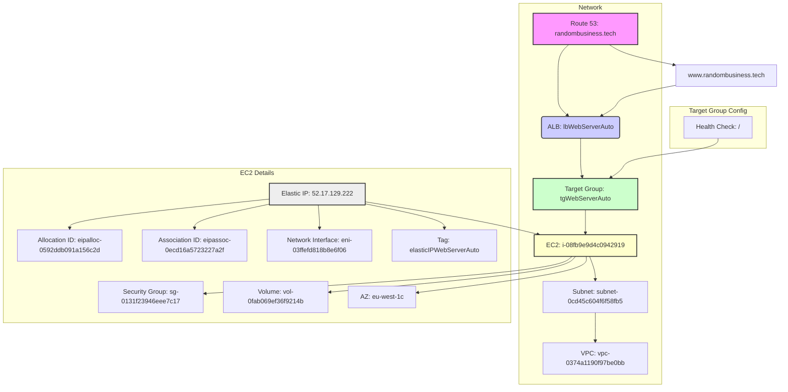

# Lab: Adding HTTPS Certificates via Load Balancer and Targets to EC2 Instance

## Table of Contents

[Objective](#objective)  
[Architecture Overview](#architecture-overview)  
[Prerequisites](#prerequisites)  
[Step 1: Obtain an SSL/TLS Certificate](#step-1-obtain-an-ssltls-certificate)  
[Step 2: Create a Target Group](#step-2-create-a-target-group)  
[Step 3: Create an Application Load Balancer](#step-3-create-an-application-load-balancer)  
[Step 4: Configure Security Groups](#step-4-configure-security-groups)  
[Step 5: Update A Records in Hosted Zone](#step-5-update-a-records-in-hosted-zone)  
[Step 6: Test Your Setup](#step-6-test-your-setup)  
[Step 7: Update WordPress Configuration (If Applicable)](#step-7-update-wordpress-configuration-if-applicable)  
[Conclusion](#conclusion)  
[Additional Tips](#additional-tips)  
[Total Diagram](#total-diagram)  

## Objective
Configure an AWS Application Load Balancer with HTTPS certificates and targets to serve an EC2 instance hosting a web application.

## Architecture Overview




## Prerequisites

- An existing EC2 instance running a web server.
- A registered domain name.

Go to route 53 and create hosted zone for your domain name e.g. example.com
Go to your Domain Name Provider website and change the DNS servers to the ones provided by AWS in your newly created Hosted Zone

## Step 1: Obtain an SSL/TLS Certificate

### Using AWS Certificate Manager (ACM)

- Choose **"Request a certificate"** if you want AWS to manage your certificate automatically.

1. **On your AWS Console Search for `Certificate Manager`**:
    - Go to the AWS Management Console and select the Certificate Manager service.
2. **Request Public Certificate**:
    - Click on the orange Request button in the top right hand corner.
    - Select `Request a public certificate` and click the Next button. 
3. **Validate Domain Ownership**:
    - Enter your domain name e.g. `example.com`
    - Select DNS validation then hit the Request button. 
4. **Wait for Certificate Issuance**:
    - The certificate status will be `Pending validtion`.
    - To get your Certificate approved, click on the `Create records in Route 53` button.
    - Select your Domain name and click on the `Create records` button. A CNAME record will be added to youe Hosted Zone and this will validate your certificate. 
    - Wait 5 minutes for your Certificate Status to change to `Issued`.

## Step 2: Create a Target Group

1. **Navigate to Target groups**:
    - In the AWS Management Console, search for Target groups service.
2. **Create a Target Group**:
    - Click on "Create target group".
    - Choose "Instances" as the target type.
    - Enter the Target group name as `tgWebServerAuto`.
    - The protocol port should be set to HTTP and port to 80.
    - Leave all other settings as default values and click on the Next button.
    - You will be taken to the `Register targets` page. Select your instance and click on the `Include as pending below` button.
    - Finally click on the large orange button on the bottom right that says `Create target group`

## Step 3: Create a Security Group for the Load Balancer

You will have two separate security groups: one for your EC2 instance and one for your Load Balancer.

- 1. **Create a Security Group**:
    - In your AWS console, search for "Security Groups" and then click "Create security group".
    - Set the Security group name to sgLbWebServerAuto
    - For Descrition put "Sg for Lb"
    - Add one **inbound** rule for HTTP (80) and choose Destination as Anywhere-IPv4.
    - Add one **inbound** rule for HTTPS (443) and choose Destination as Anywhere-IPv4.
    - Add one **outbound** rule for All traffic and choose Destination as Anywhere-IPv4.
    - Finally click Create security group

## Step 4: Create an Application Load Balancer

1. **Create a Load Balancer**:
    - In your AWS console, search for "Load balancers" and then click "Create load balancer".
    - Cick the Create button under the "Application Load Balancer".
    - Enter the Load Balancer name as `lbWebServerAuto`.
    - Set the Scheme to "internet-facing".
    - Select all 3 eu-west zones under "Availability Zones and subnets"
    - Select Security Group you created above.
2. **Configure Listeners**:
    - Set the Default action oh HTTP port 80 to forward to your target group
    - Click the Add Listner button
    - Create an HTTPS listener on port `443`.
    - Forward traffic to your target group.
    - Select your certificate from AWS Certificate Manager.
3. **Redirect HTTP to HTTPS**:
    - Find Listners and Rules
    - Click on the rule for HTTP:80
    - Select the rule under Listner Rules
    - Go to Actions and select Edit rule
    - Select Redirect to URL.
    - Beside HTTPS enter Port 443 and click Save changes.

## Step 5: Create A Record in Hosted Zone

### Point Domain Name to Load Balancer

1. **Navigate to Route 53**:
    - Go to the AWS Management Console and select the Route 53 service.
2. **Select Your Hosted Zone**:
    - Choose the hosted zone corresponding to your domain name.
3. **Create or Update A Records**:
    - Click "Create record"
    - Turn on the Alias switch
    - Choose endpoint as "Alias to Application and Classic Load Balancer"
    - Choose region as Europe (Ireland)
    - Choose load balancer as the load balancer you created above. There will only be one option in the dropdown. 
    - Click "Create records"
    - 
## Step 6: Update the WordPress Address and Site Address 
Ssh into your instance:
```bash
ssh vm
```
Replace "example.com" with your Domain name in the commands below. Then run these WordPress CLI commands to change the URLs:
```bash
wp option update siteurl 'https://example.com'  --path=/var/www/html/
wp option update home 'https://example.com' --path=/var/www/html/ 
```

## Step 7: Test Your Setup

### Verify HTTPS Connection

1. **Access Your Website**:
    - Use your domain name or load balancer's DNS name over HTTPS.
2. **Verify Certificate**:
    - Confirm that SSL/TLS certificate is correctly applied and trusted by browsers.

## Step 7: Update WordPress Configuration (If Applicable)

### Update Site URLs

1. **Access WordPress Admin Dashboard**.
2. Navigate to **Settings > General**.
3. Update both **WordPress Address (URL)** and **Site Address (URL)** fields with HTTPS URLs.

## Conclusion

You have successfully configured an Application Load Balancer with HTTPS certificates and targets serving an EC2 instance hosting a web application. Ensure all resources are correctly configured and test thoroughly.

---

### Additional Tips

- **Monitor Load Balancer Logs**
Use AWS CloudWatch for monitoring load balancer logs for errors or unusual patterns.
- **Use AWS CLI for Automation**
Automate tasks like creating load balancers and target groups using AWS CLI commands.
- **Security Best Practices**
Regularly review security group configurations ensuring least privilege principles.

### Total Diagram

