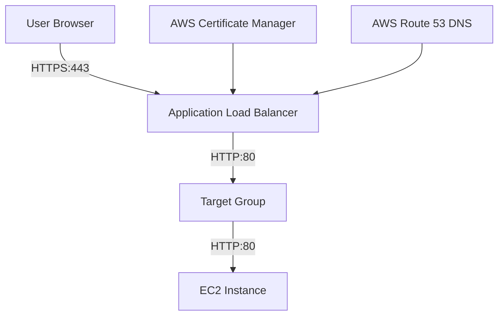
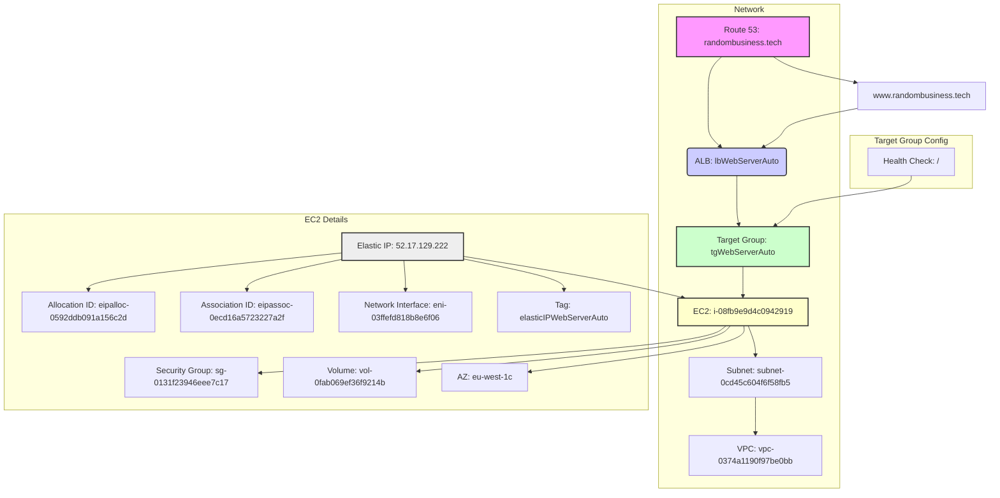

# Lab: Adding HTTPS Certificates via Load Balancer and Targets to EC2 Instance

## Table of Contents

[Objective](#objective)  
[Architecture Overview](#architecture-overview)  
[Prerequisites](#prerequisites)  
[Step 1: Obtain an SSL/TLS Certificate](#step-1-obtain-an-ssltls-certificate)  
[Step 2: Create a Target Group](#step-2-create-a-target-group)  
[Step 3: Create an Application Load Balancer](#step-3-create-an-application-load-balancer)  
[Step 4: Configure Security Groups](#step-4-configure-security-groups)  
[Step 5: Update A Records in Hosted Zone](#step-5-update-a-records-in-hosted-zone)  
[Step 6: Test Your Setup](#step-6-test-your-setup)  
[Step 7: Update WordPress Configuration (If Applicable)](#step-7-update-wordpress-configuration-if-applicable)  
[Conclusion](#conclusion)  
[Additional Tips](#additional-tips)  
[Total Diagram](#total-diagram)  

## Objective
Configure an AWS Application Load Balancer with HTTPS certificates and targets to serve an EC2 instance hosting a web application.

## Architecture Overview




## Prerequisites

- An existing EC2 instance running a web server.
- A registered domain name.

Go to route 53 and create hosted zone for your domain name e.g. example.com
Go to your Domain Name Provider website and change the DNS servers to the ones provided by AWS in your newly created Hosted Zone

## Step 1: Obtain an SSL/TLS Certificate

### Using AWS Certificate Manager (ACM)

- Choose **"Request a certificate"** if you want AWS to manage your certificate automatically.

1. **On your AWS Console Search for `Certificate Manager`**:
    - Go to the AWS Management Console and select the Certificate Manager service.
2. **Request Public Certificate**:
    - Click on the orange Request button in the top right hand corner.
    - Select `Request a public certificate` and click the Next button. 
3. **Validate Domain Ownership**:
    - Enter your domain name e.g. `example.com`
    - Select DNS validation then hit the Request button. 
4. **Wait for Certificate Issuance**:
    - The certificate status will be `Pending validtion`. Wait 3 minutes for the status to change to Approved
    - Once validated, AWS will issue your certificate.

## Step 2: Create a Target Group

1. **Navigate to Elastic Load Balancing**:
    - In the AWS Management Console, go to the Elastic Load Balancing service.
2. **Create a Target Group**:
    - Click on "Target groups" and then "Create target group".
    - Choose "Instances" as the target type.
    - Set the protocol to HTTP and port to 80 (or your web server's port).
    - Select your EC2 instance.
3. **Configure Health Checks**:
    - Health check protocol: HTTP
    - Path: `/` (or any path returning HTTP status code `200`)
    - Interval: `30 seconds`
    - Timeout: `5 seconds`
    - Healthy threshold: `3`
    - Unhealthy threshold: `3`

## Step 3: Create an Application Load Balancer

1. **Create a Load Balancer**:
    - In Elastic Load Balancing dashboard, click on "Load balancers" and then "Create load balancer".
    - Choose "Application Load Balancer".
    - Set the scheme to "internet-facing".
2. **Configure Listeners**:
    - Create an HTTPS listener on port `443`.
    - Select your SSL/TLS certificate from AWS Certificate Manager.
    - Forward traffic to your target group.
3. **Add HTTP Listener (Optional)**:
    - Create an HTTP listener on port `80`.
    - Add a rule to redirect all traffic from port `80` (HTTP) to port `443` (HTTPS).
4. **Select Availability Zones**:
    - Ensure the load balancer is enabled in the same Availability Zone as your EC2 instance.

## Step 4: Configure Security Groups

You should have two separate security groups: one for your EC2 instance and one for your Load Balancer.

- **EC2 Security Group**:
    - Allow inbound HTTP traffic (port 80) from the Load Balancer security group's ID.
- **Load Balancer Security Group**:
    - Allow inbound HTTP (80) and HTTPS (443) traffic from anywhere (`0.0.0.0/0`).


## Step 5: Update A Records in Hosted Zone

### Point Domain Name to Load Balancer

1. **Navigate to Route 53**:
    - Go to the AWS Management Console and select the Route 53 service.
2. **Select Your Hosted Zone**:
    - Choose the hosted zone corresponding to your domain name.
3. **Create or Update A Records**:
    - Click "Create record set" or edit existing A record.
    - Set **Name** as your domain name (e.g., `randombusiness.tech`) or subdomain.
    - Set **Type** as A – IPv4 address.
    - Set **Alias** as "Yes".
    - Select your load balancer's DNS name in the Alias target dropdown.
4. **Save Changes**:
    - Click "Create records" or "Save changes".

### Using AWS CLI

Replace `ZONE_ID` and DNS names accordingly:

```bash
aws route53 change-resource-record-sets \
--hosted-zone-id ZONE_ID \
--change-batch '{
    "Changes": [{
        "Action": "UPSERT",
        "ResourceRecordSet": {
            "Name": "randombusiness.tech",
            "Type": "A",
            "AliasTarget": {
                "DNSName": "lbWebServerAuto-1810038198.eu-west-1.elb.amazonaws.com",
                "HostedZoneId": "Z32O12XQLNTSW2",
                "EvaluateTargetHealth": false
            }
        }
    }]
}'
```


## Step 6: Test Your Setup

### Verify HTTPS Connection

1. **Access Your Website**:
    - Use your domain name or load balancer's DNS name over HTTPS.
2. **Verify Certificate**:
    - Confirm that SSL/TLS certificate is correctly applied and trusted by browsers.

## Step 7: Update WordPress Configuration (If Applicable)

### Update Site URLs

1. **Access WordPress Admin Dashboard**.
2. Navigate to **Settings > General**.
3. Update both **WordPress Address (URL)** and **Site Address (URL)** fields with HTTPS URLs.

## Conclusion

You have successfully configured an Application Load Balancer with HTTPS certificates and targets serving an EC2 instance hosting a web application. Ensure all resources are correctly configured and test thoroughly.

---

### Additional Tips

- **Monitor Load Balancer Logs**
Use AWS CloudWatch for monitoring load balancer logs for errors or unusual patterns.
- **Use AWS CLI for Automation**
Automate tasks like creating load balancers and target groups using AWS CLI commands.
- **Security Best Practices**
Regularly review security group configurations ensuring least privilege principles.

### Total Diagram

