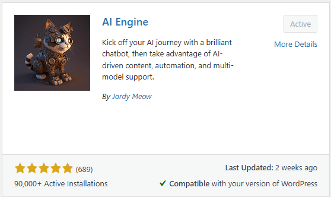
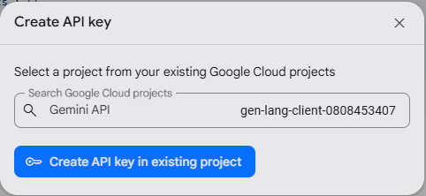
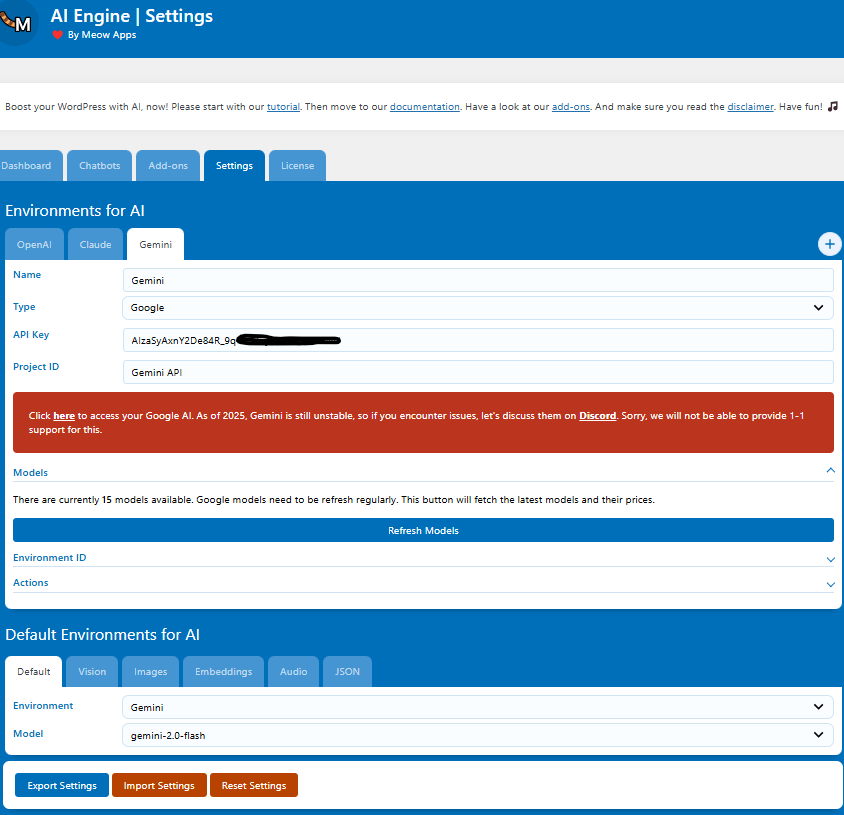
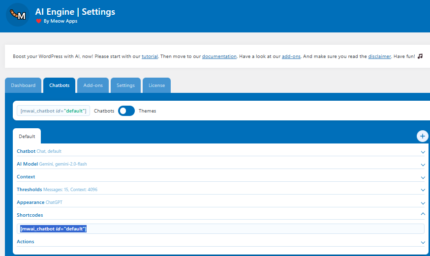
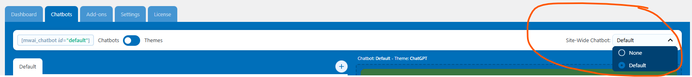
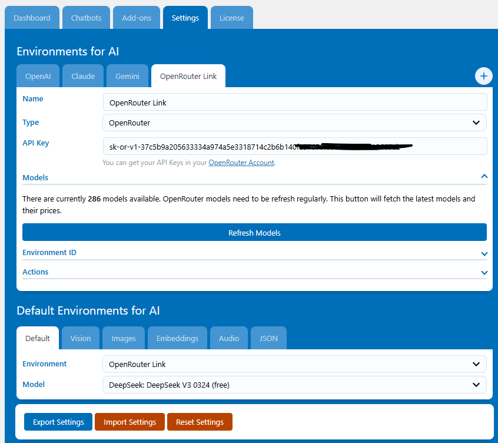

# WordPress AI Integration Lab

This lab guide will walk you through integrating advanced AI capabilities into your WordPress site using the AI Engine plugin from Meow Apps and the Google Gemini API via Google AI Studio.

## Overview

In this lab, you will:
1. Set up the AI Engine plugin in WordPress
2. Create a Google AI Studio account
3. Configure Gemini API access credentials
4. Implement AI-powered features on your WordPress site
5. Test various AI functionalities

## Prerequisites

- A working WordPress installation
- Admin access to your WordPress site
- A Google account for accessing Google AI Studio
- Basic familiarity with WordPress administration

## Lab Steps

### Part 1: Installing the AI Engine Plugin

1. Log in to your WordPress admin dashboard
2. Navigate to Plugins > Add New
3. Search for "AI Engine"
4. Look for the plugin by "Meow Apps" and click "Install Now"
5. After installation completes, click "Activate"

### Part 2: Setting Up Google AI Studio and Gemini API

1. Visit [Google AI Studio](https://makersuite.google.com/) and sign in with your Google account
2. Click on the big blue button that says "Get API key" in the top left corner
3. Click on the big blue button that says "Create API key"
4. Select a project and click on the button to create the API key. Copy it to your clipboard
   - Keep this key secure as it grants access to the API
   - Note: Google provides a free tier with limitations, which is sufficient for this lab

### Part 3: Configuring AI Engine with Gemini API

1. In your WordPress admin dashboard, navigate to Meow Apps > AI Engine > Settings
2. Select the "Gemini" tab in the AI Providers section
3. Paste your Google API key in the designated field
4. Select "gemini-2.0-flash " as the model
4. Click "Save Changes"
5. Test the connection by clicking the "Test" button

### Part 4: Creating Your First AI Chatbot

1. Go to the Chatbots tab 
2. Click "Add New" to create a new chatbot
3. Configure the basic settings:
   - Name: "Gemini Assistant"
   - Initial Prompt: "You are a helpful assistant for my website visitors."
   - Model: Select "gemini-2.0-flash"
4. Customize the appearance settings:
   - Choose a theme color
   - Set width and height parameters
   - Configure button position
5. Save your chatbot

### Part 5: Embedding the Chatbot on Your Site

1. Create a new page
2. Searh for a block alled "AI Chatbot"
3. Add this to your page
4. Save and publish your page
5. Visit the page to test your AI chatbot
6. Interact with the chatbot by asking questions or requesting information

### Part 6: Enable site-wide floating chatbot

1. Go to Meow Apps > AI Engine
2. Select the "Chatbots" tab
3. On the right side you will see a dropdown with the name Site-Wide Chatbot
4. Change this from None to Default

5. Go to your website and refresh the page
6. You should see a floating chatbot icon on the bottom right corner of your site
7. Click on the icon to open the chatbot and interact with it

### Part 7: Try out different models
1. Go to OpenRouter website
2. Create an account
3. Create an API key
4. Search for free models and read about them
5. Go to Meow Apps > AI Engine
6. Select the Settings tab
7. Create a new Environments for AI Tab
8. Give it a name and selet OpenRouter as the Type
9. Paste the API key you created in OpenRouter
10. Key pressing the refresh models button until you see the models you want to use
11. Select the free model you want to use
12. Go to the Chatbots tab
13. Select the chatbot you created earlier
14. Select the new environment you created in the Environment dropdown

### Part 8: Advanced AI Applications

Once you have the basic chatbot working, explore these additional AI features:

#### Content Generation

1. Go to AI Engine > Playground
2. Select "Gemini Pro" as the model
3. Use prompts like:
   - "Write a blog post about [topic]"
   - "Create a product description for [product]"
   - "Generate meta descriptions for SEO"
4. Copy the generated content to use in your posts or pages

#### Custom Chatbot Personalities

1. Create additional chatbots with different personas
2. Customize the initial prompt to shape the AI's personality, for example:
   - Customer Service: "You are a helpful customer service representative for our online store..."
   - Technical Support: "You are a technical support specialist who helps users troubleshoot..."
   - Content Advisor: "You are an expert content strategist who provides advice on..."

### Part 7: Performance Optimization and Best Practices

1. Monitor API usage in Google AI Studio dashboard
2. Implement rate limiting in AI Engine settings to control costs
3. Use caching options to improve performance
4. Set appropriate context length to balance quality and costs
5. Regularly review and refine your prompts for better results

### Troubleshooting

Common issues and solutions:
- API key not working: Verify the key is correct and has the proper permissions
- Rate limit exceeded: Check your Google AI Studio quota and consider upgrading if needed
- Slow responses: Adjust token limits or implement caching
- Content moderation: Use AI Engine's built-in moderation settings to filter inappropriate content

## Conclusion

In this lab, you've successfully integrated advanced AI capabilities into your WordPress site using the AI Engine plugin and Google's Gemini API. You can now offer your visitors an interactive AI assistant, generate content efficiently, and leverage AI for various site enhancements.

## Additional Resources

- [AI Engine Documentation](https://meowapps.com/ai-engine/documentation/)
- [Google Gemini API Documentation](https://ai.google.dev/docs/gemini_api_overview)
- [Prompt Engineering Best Practices](https://ai.google.dev/docs/prompt_best_practices)
- [WordPress Developer Resources](https://developer.wordpress.org/)

## Next Steps

Consider exploring these additional possibilities:
1. Integrating AI-generated content into your editorial workflow
2. Creating specialized chatbots for different sections of your site
3. Implementing AI-powered form assistants
4. Using AI for content translation and localization
5. Setting up sentiment analysis for comments and user feedback

